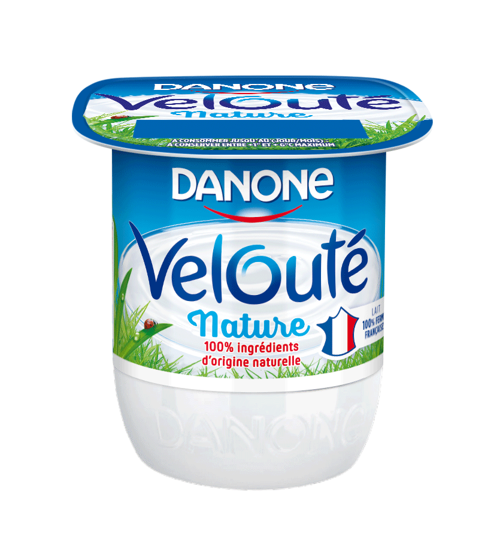
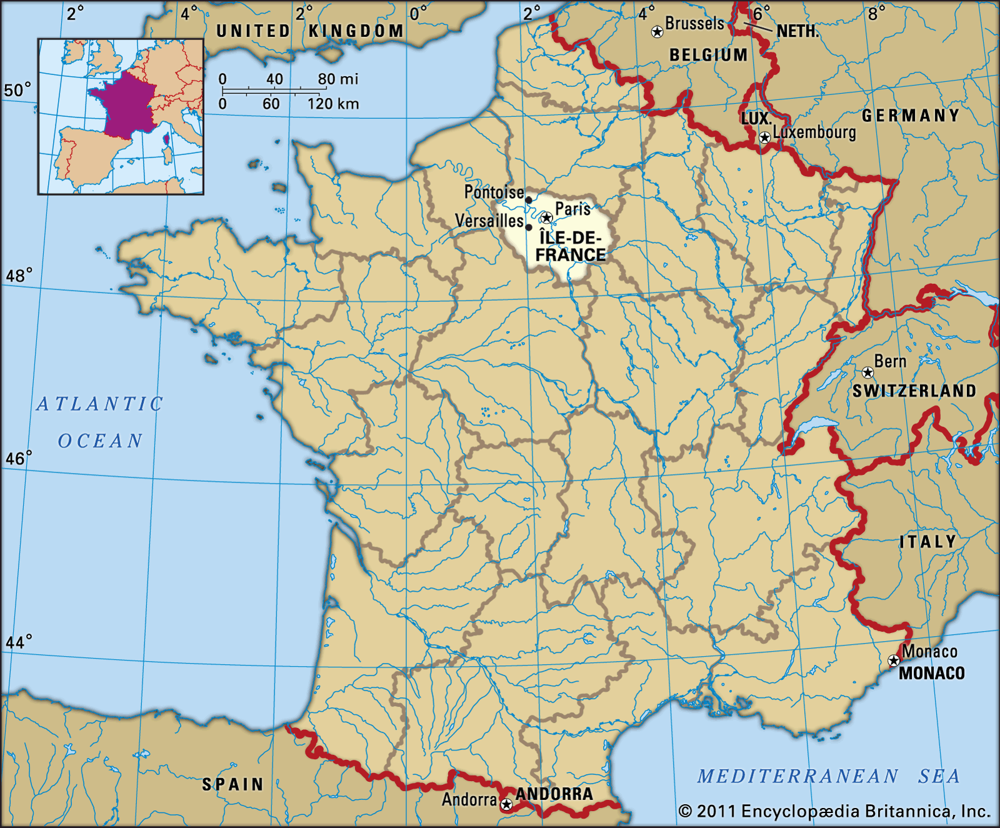

# 📋 Scope Note — Danone Velouté Nature 125 g (Île-de-France)

---

## 🥛 SKU

**Danone Velouté Nature 125 g** *(local French variant)*

Produced at Danone's French network with **🏭 Ferrières-en-Bray** as the representative production site supplying the Île-de-France region.

---

## 🗺️ Geography

Distribution modeled for the **Île-de-France region**.

  
  

  Image from: https://www.britannica.com

---

## 🎯 System Boundaries

> **Cradle-to-retail** greenhouse-gas emissions

---

## ✅ Included Processes

| Process | Description |
|---------|-------------|
| 🥛 **Raw Materials** | Milk, skimmed milk powder, cream, yogurt cultures |
| 📦 **Packaging** | Plastic pot manufacture |
| 🚛 **Inbound Logistics** | Dairy farm → factory (~60 km) |
| 🏭 **Manufacturing** | Production processes |
| 🚚 **Outbound Distribution** | Factory → Île-de-France retail DCs (truck ~130–170 km) |

---

## ❌ Excluded Processes

- Consumer use
- End-of-life

---

## 📅 Baseline Year

### 2020
*Aligned with Danone's Science Based Targets*

---

## 🎯 Confidence Level

### 🟡 MEDIUM

**Assessment Details:**
- ✅ Ingredient percentages based on packaging information
- ⚠️ Distance and facility assumptions are proxy-based
- 🔄 Will be tested in sensitivity analysis

---

### 📊 Quick Stats

| Metric | Value |
|--------|-------|
| 📍 **Region** | Île-de-France |
| 🏭 **Production Site** | Ferrières-en-Bray |
| 📏 **Inbound Distance** | ~60 km |
| 🚛 **Outbound Distance** | ~130-170 km |
| 📋 **Assessment Type** | Cradle-to-retail GHG |

---

📈 <em>Academic project for Supply Chain Management career development</em> 📈 
<em>⚠️ This is a hypothetical case study for educational purposes only</em>

